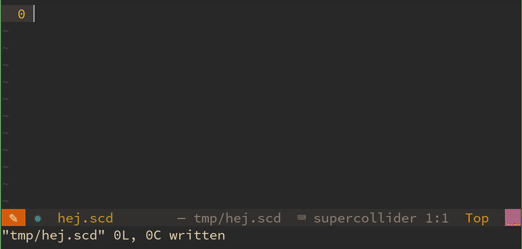

# lua-supercollider-snippets



Supercollider snippets for the [snippets.nvim](https://github.com/norcalli/snippets.nvim) neovim plugin.

# Installation
Using vim-plug:

```vim
Plug 'madskjeldgaard/lua-supercollider-snippets'
Plug 'norcalli/snippets.nvim'
```

# Usage
See all snippets available:

`lua require'supercollider-snippets.utils'.print_all()`

Type one of these names and expand using whatever key you have mapped in snippets.nvim
